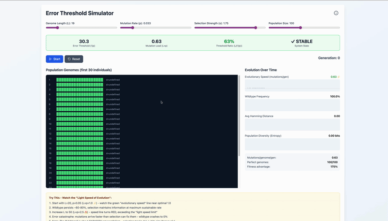
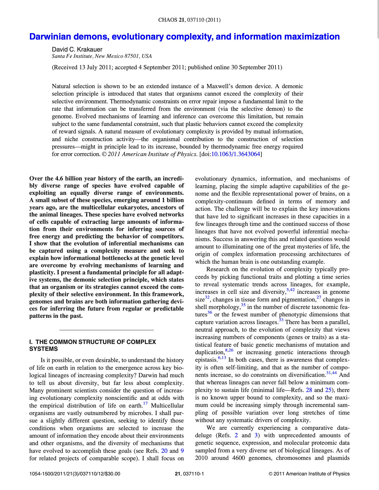
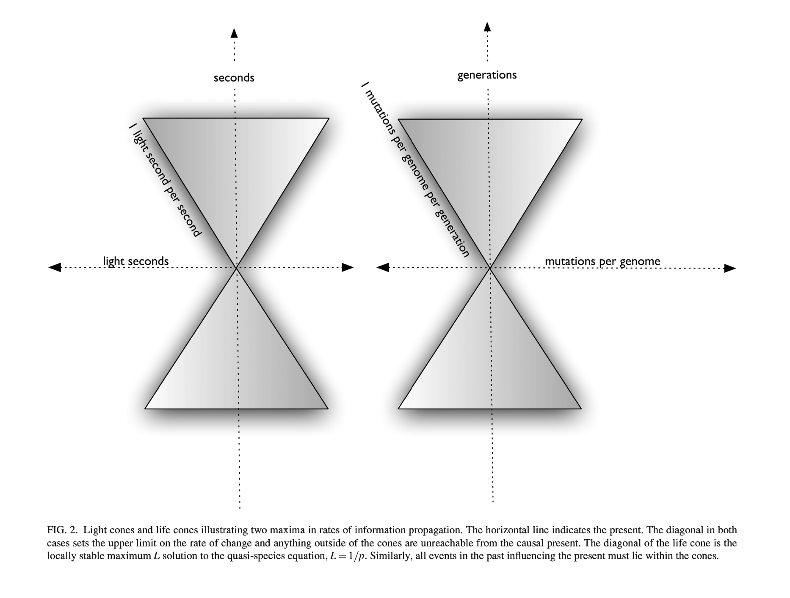

# Evolution Light Speed 🧬⚡

An interactive visualization demonstrating **Eigen's Error Threshold** and the fundamental thermodynamic limits on biological evolution, based on the groundbreaking paper ["Darwinian demons, evolutionary complexity, and information maximization"](https://doi.org/10.1063/1.3643064) by **David C. Krakauer** (Santa Fe Institute).

## 🎬 Demo



**[▶️ Watch Full Demo Video (MP4)](./demo.mp4)** | **[Download MOV](./demo.mov)**

*The GIF above shows the first 10 seconds - click to watch the full 49-second demonstration*

---

## 🎯 What This Simulates

<p align="center">
  
  <br>
  <em>Krakauer's groundbreaking 2011 paper in Chaos journal</em>
</p>

This app visualizes one of the most profound discoveries in evolutionary theory: **there exists a "speed limit" for evolution** - analogous to the speed of light in physics. Just as matter cannot exceed light speed, **natural selection cannot maintain genetic information when mutations arrive faster than ~1 bit per generation**.

### The Error Threshold Equation

```
L < 1/p
```

Where:
- **L** = Genome length (number of bits)
- **p** = Mutation rate per site
- **L×p** = Mutation load (mutations per genome per generation)

**When L×p > 1**: Error catastrophe occurs - mutations overwhelm selection and genetic information collapses.

---

## 🚀 Try It Live

### Installation

```bash
git clone https://github.com/ecsplendid/evolution-light-speed.git
cd evolution-light-speed
npm install
npm run dev
```

Open http://localhost:5173

### Quick Experiment

1. **Stable Evolution** (below threshold):
   - Set L=20, p=0.05 → L×p = 1.0 ⚡
   - Click "Start"
   - Watch: Wildtype persists at 60-80%, green "Evolutionary Speed" line

2. **Error Catastrophe** (above threshold):
   - Click "Reset"
   - Set L=50, p=0.05 → L×p = 2.5 🔥
   - Click "Start"
   - Watch: Wildtype crashes to 0%, speed line turns red
   - Genomes become chaotic red/green mess

---

## 📊 Understanding the Visualizations

### 1. **Evolutionary Speed Graph** (Top)
- **⚡ Green (<1.2)**: Optimal - at evolutionary "light speed"
- **⚠️ Amber (1.2-1.5)**: Warning zone
- **🔥 Red (>1.5)**: Catastrophe - exceeding fundamental limit
- **Dotted line at 1.0**: The "speed of light" for evolution

### 2. **Population Genomes** (Left)
- Each row = one individual's genome
- **Green blocks** = correct bits (wildtype state)
- **Red blocks** = mutations
- **d=X**: Hamming distance (number of mutations from perfect)
- **★ WT**: Wildtype (perfect genome, d=0)

### 3. **Wildtype Frequency** (Right)
Shows fraction of perfect genomes over time
- **High (60-80%)**: Selection working, evolution maintains information
- **Low (~0%)**: Error catastrophe, selection has failed

### 4. **Avg Hamming Distance**
Average mutations per genome
- **Low (~3-8)**: Healthy population
- **High (~25-35)**: Population corrupted

---

## 🧪 The Science

### From the Paper (Krakauer, 2011)

> "Natural selection is shown to be an extended instance of a Maxwell's demon device. A demonic selection principle is introduced that states that organisms cannot exceed the complexity of their selective environment. Thermodynamic constraints on error repair impose a fundamental limit to the rate that information can be transferred from the environment (via the selective demon) to the genome."

### Key Concepts

#### 1. **The Darwinian Demon**
Natural selection acts like Maxwell's demon - sorting adaptive from maladaptive variants. But it's bounded by thermodynamic constraints:

```
Information Gain = Death
```

To acquire log(N) bits of information requires ~N genomes to die (differential mortality).

#### 2. **The Life Cone** (Figure 2, p. 6)
Just as relativity has light cones limiting causal influence, evolution has "life cones":

<p align="center">
  
  <br>
  <em>Figure 2 from the paper: Light cones (physics) and Life cones (evolution) both define fundamental speed limits</em>
</p>

```
Mutations/genome/generation ≤ 1.0
```

This is the **maximum sustainable rate of evolutionary change** while maintaining genetic information.

#### 3. **Metabolic Scaling** (Section IV.A, p. 5)
Error correction costs energy. The relationship between genome size and body mass:

```
L = k'm^(1/4)
p = km^(-1/4)
```

Larger organisms can afford longer genomes because metabolic rate per unit mass decreases.

#### 4. **The Full Threshold Condition**
With realistic selection strength s:

```
q^L > 1/(1+s)
```

Where q = 1-p (per-bit fidelity). This means:
- **Weak selection** (s=0.2): Much lower effective threshold
- **Strong selection** (s=2.0): Threshold approaches L×p ≈ 1

**Try this**: With L=19, p=0.033, you need s≥2.0 to maintain wildtype!

#### 5. **Parallel Selection**
The "1 bit/gen" is about **capacity, not parallelism**:
- Selection acts on ALL L sites **simultaneously**
- But total information throughput cannot exceed ~1 bit/gen
- This is a bandwidth constraint, not sequential processing

---

## 🎓 Educational Use Cases

### For Students
- Visualize mutation-selection balance
- Understand why viruses have short genomes (high mutation rates)
- See phase transitions in evolutionary dynamics
- Explore information theory in biology

### For Researchers
- Test intuitions about error thresholds
- Demonstrate quasi-species theory
- Illustrate thermodynamic constraints on adaptation
- Show relationship between genome size and mutation rate

### Experiments to Try

1. **Viral vs Mammalian Genomes**
   - Virus: L=10, p=0.1 (high mutation) → catastrophe!
   - Mammal: L=100, p=0.001 (low mutation) → stable if s is high

2. **Selection Strength Matters**
   - L=20, p=0.05, s=0.2 → collapse
   - L=20, p=0.05, s=2.0 → stable!

3. **Phase Transition**
   - Fix p=0.05
   - Slowly increase L from 10→50
   - Watch sharp transition around L=20

---

## 🏗️ Technical Details

### Built With
- **React 18** - UI framework
- **Vite** - Build tool
- **TailwindCSS** - Styling
- **Lucide React** - Icons

### Algorithm
Implements the **Quasi-Species Equation** (Eigen & Schuster, 1977):

```javascript
// Selection (fitness-proportional)
offspring = weightedSample(population, fitness)

// Mutation (bit-flip model)
mutated = offspring.map(bit =>
  Math.random() < p ? 1-bit : bit
)
```

Each generation:
1. Calculate fitness: wildtype has fitness (1+s), mutants have fitness 1
2. Reproduce proportionally to fitness
3. Apply mutations with probability p per bit
4. Track statistics (wildtype freq, Hamming distance, entropy)

### Performance
- Runs at ~50ms per generation
- Stores last 200 generations for graphs
- Handles genomes up to L=100
- Population sizes up to 200

---

## 📚 Learn More

### Original Paper
**Krakauer, D.C. (2011).** "Darwinian demons, evolutionary complexity, and information maximization." *Chaos* 21, 037110.
📄 [DOI: 10.1063/1.3643064](https://doi.org/10.1063/1.3643064)
📄 [PDF included in this repo](./CHAOEH213037110_1.pdf)

### Related Concepts
- **Eigen's Error Threshold** (1971) - Original discovery
- **Quasi-Species Theory** - Population-level evolution under mutation
- **Maxwell's Demon** - Information & thermodynamics
- **Fisher Information** - Connection to evolutionary dynamics

### MLST Deep Dives

**Machine Learning Street Talk** has excellent discussions with David Krakauer on these concepts:

🎥 **YouTube**: [Masterclass on Evolutionary Complexity with David Krakauer](https://www.youtube.com/watch?v=jXa8dHzgV8U)
📝 **Patreon**: [Extended Masterclass Discussion](https://www.patreon.com/posts/masterclass-on-142898847)

These explore:
- Niche construction as complexity ratchet
- Learning vs evolution (both are selective demons!)
- Information theory in biology
- The origin of complex information processing

---

## 🙏 Credits

### Paper Author
**David C. Krakauer**
President, Santa Fe Institute
Professor of Complex Systems

This simulator is a humble educational visualization of his profound theoretical work bridging thermodynamics, information theory, and evolutionary biology.

### Simulator
Built by the **Machine Learning Street Talk** team to make these deep ideas accessible and interactive.

- **Website**: [https://mlst.ai](https://mlst.ai)
- **YouTube**: [@MachineLearningStreetTalk](https://www.youtube.com/@MachineLearningStreetTalk)
- **Patreon**: [MLST Patreon](https://www.patreon.com/mlst)

---

## 📖 Citation

If you use this in research or education, please cite:

```bibtex
@article{krakauer2011darwinian,
  title={Darwinian demons, evolutionary complexity, and information maximization},
  author={Krakauer, David C},
  journal={Chaos: An Interdisciplinary Journal of Nonlinear Science},
  volume={21},
  number={3},
  pages={037110},
  year={2011},
  publisher={AIP Publishing}
}
```

And link to this interactive simulator:
```
https://github.com/ecsplendid/evolution-light-speed
```

---

## 🛠️ Development

```bash
# Development
npm run dev

# Build for production
npm run build

# Preview production build
npm run preview
```

---

## 📜 License

**Code**: MIT License (see LICENSE file)
**Paper**: © 2011 American Institute of Physics (included for educational purposes)

---

## 🌟 Star History

If this helped you understand evolution's fundamental limits, please ⭐ star the repo!

---

**"The ability to propagate a functionally superior genotype is proportional to the diversity of genotypes and their dissipation from the population."**
— David C. Krakauer, 2011
